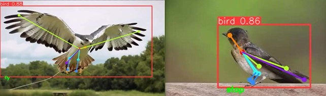
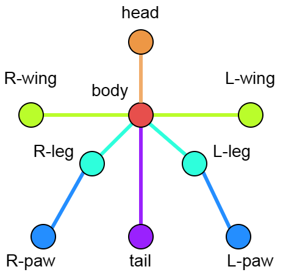
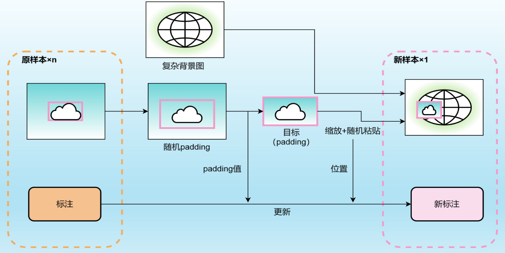
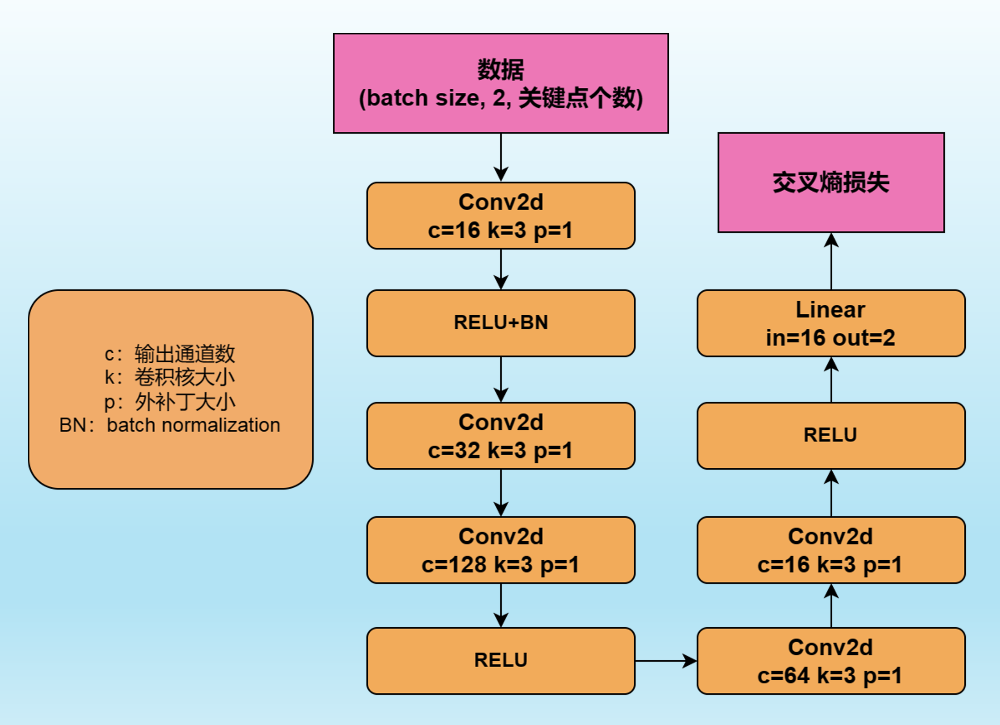
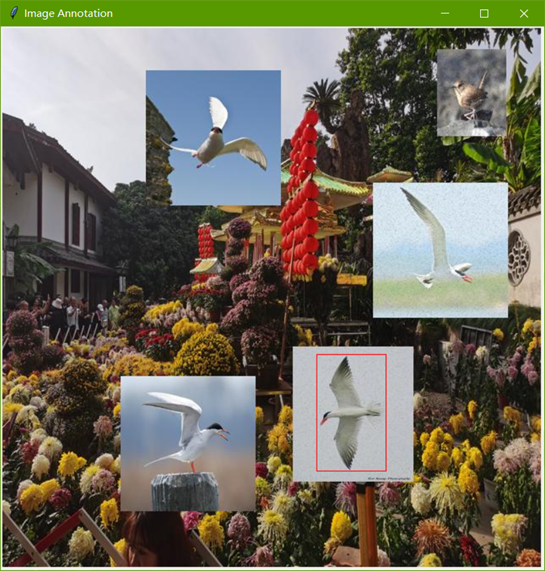
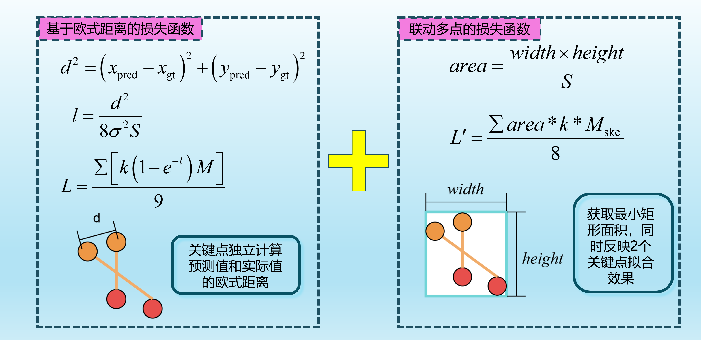
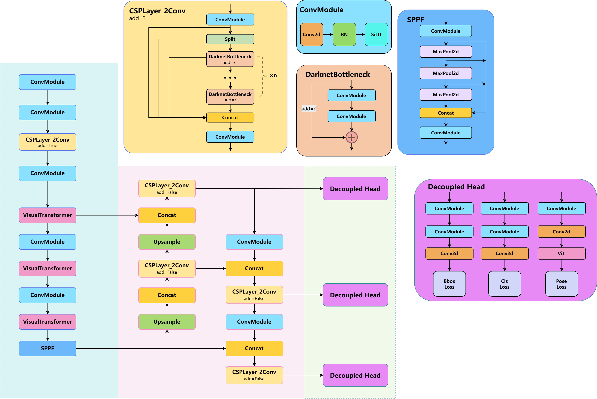

**This project is based on YOLOv8**: https://github.com/ultralytics/ultralytics
[中文 README](README.md)
# 🔥Dataset Links
Baidu Cloud: https://pan.baidu.com/s/1IAbgjSZs9G7XmKPEwMiBdw?pwd=1213 Extraction Code: 1213  
Google: https://drive.google.com/drive/folders/12iIgp0_4aPTHtyqNYhfS4ZwWmwBjVXlE?usp=drive_link  
- `bird_pose.zip` is the dataset for pose output convolutional network, and `posehead.pt` is its trained model.  
`bird.zip` is the YOLOv8 COCO format keypoint detection dataset, and `best.pt` is the corresponding dataset trained in this work (not the strongest).  
**Both networks need to be used together for pose estimation. For more details, see the introduction below.**

# 🔥Overview
This project is based on YOLOv8, focusing on bird pose detection as the task. It designs bird keypoints, uses a new keypoint regression loss function, employs a ViT module to change the network structure, and designs an external convolutional output network to map keypoints to bird pose classification, providing data augmentation operations based on stitching. The results are as follows:

# 🔥Technology
## Bird Keypoint Design
The label structure of the dataset is based on the following image:

## YOLOv8 Bird Keypoint Dataset
The overall format of the COCO dataset labels for YOLO keypoints is as follows:
`<class-index> <x> <y> <width> <height> <px1> <py1> <p1-visibility> <px2> <py2> <p2-visibility> …<pxn> <pyn> <p2-visibility>`
- The number of rows in the annotated data corresponds to the number of targets in a single image, with each row representing one target, including the classification label, a bounding box (1), and a keypoint array (9) for annotations. The bounding box is located based on its center, and since not all 9 keypoints may appear for each target, a status value must be annotated for the keypoints. When a keypoint does not exist, the loss for that keypoint regression will be excluded.

## Data Augmentation
YOLOv8 comes with several data augmentation techniques. I implemented a similar one. If you need to use it additionally, the project also provides this script. The process is as follows: provide a background folder containing various background images without birds, slightly enlarge the bounding boxes of the annotated bird dataset, and paste them onto the background images. You can choose to paste multiple targets and set the scaling factor.
  
The results are shown in the following image:

## Keypoints -> Pose Classification
By connecting an external convolutional output network to the YOLOv8 keypoint output, pose classification can be obtained. The network structure is very simple, which reflects the efficiency of keypoint detection for pose estimation. This output network can be trained separately from YOLOv8, allowing for different output networks to be designed for various tasks.
  
**Annotated datasets to train this network**:  
I wrote an annotation script using Python's Tkinter library, which displays the annotated images sequentially and allows the corresponding targets to be selected one by one. The classification is achieved by typing 0 or 1 on the keyboard, generating the corresponding label file in the format: `<class-index> <px1> <py1> <px2> <py2> …<pxn> <pyn>`.

## New Loss Function
You can choose to use the newly designed loss function for training (it may not necessarily be more effective):

## New Network with ViT
You can choose whether to use the ViT module to change the network structure (it will be slower):

# 🔥Project Structure
- `datasets`: Folder containing datasets and their tools.
- `imgs`: Storage for images and videos used for prediction.
- `posehead`: Folder for the external convolutional output network.
- `runs`: Storage for training and validation results.
- `ultralytics`: The core of YOLOv8.
- Other folders do not need detailed understanding.

# 🔥Important File Descriptions
## Main Folder
- `测试.ipynb`: Script for training (generally not used), predicting (images or videos), and validating the model. Video prediction targets the pose classification task with the external convolutional output network added.
- `人类.py`: Original project's prediction script for humans, requires modifications as stated in "Changes."
- `对比效果.py`: Image prediction script that predicts the same image using **two models** and displays the results side by side.
- `网络图生成.py`: Generates a detailed graph of the network (onnx format file), including tensor shapes, network parameters, etc., for debugging or overviewing the network.
- `训练.py`: Script for training the model.
- `预测.py`: Script for predicting images.
- `验证.py`: Script for validating the model.

## posehead Folder
- `PoseHead.py`: Network structure of the external convolutional output network.
- `train.py`: Script for training PoseHead.
- `posehead.pt`: The trained model.

## datasets Folder
- `background`: Folder containing background images, used for data augmentation.
- `bird`: Dataset used for training the YOLO network.
- `bird_enhance`: Folder storing images and annotations generated from data augmentation.
- `bird_pose`: Dataset used for training the external convolutional output network PoseHead.
- `数据集转换.py`: Changes the dataset format from storing images/labels separately under `train/valid/test` to storing them under `images/labels` as `train/val/test`.
- `数据增强.py`: Data augmentation script, see the script for details.
- `姿态分类标注.py`: This script generates the annotation files needed for the PoseHead network dataset, see the script for details.

## ultralytics Folder
- `cfg/default.yaml`: Contains configurations and hyperparameters for model training, validation, and prediction. You can modify it here or set it in the function calls.
- `cfg/models/v8/yolov8-pose.yaml`: Contains the network structure for YOLOv8 pose recognition, including modified structures.
- `cfg/datasets`: Contains various dataset configuration yaml files, including the `bird.yaml` file for this project's bird recognition.
- `nn/modules`: Contains network structure files, where `clip_model.py` is the structure of the ViT model that was newly added.
- `utils`: `loss.py` contains loss functions, `metrics.py` contains evaluation metrics.

# 🔥Modification Operations
**You can choose whether to change the network structure, whether to use the new loss function, and other technical operations through the following steps.**  
**Note: If you want to directly use the weight files in the dataset links, do not modify items 1-3.**
1. New Structure: `ultralytics/cfg/models/v8/yolov8-pose.yaml`, there are multiple groups of backbones; use one group and comment out the others.
2. New Decoupled Head: `ultralytics/nn/modules/head.py`, under the `Pose` class, `self.cv4` (around line 161), one group uses ViT, and the other does not.
3. Changes for Bird and Human Pose Recognition: `ultralytics/utils/plotting.py`, under the `Annotator` class, the `kpts` function's bird variable, set to True to detect birds.
4. New Keypoint Loss Function: `ultralytics/utils/loss.py`, in the `KeypointLoss` class's forward function (line 138), the `new_poseloss` variable determines whether to use the new loss function.
