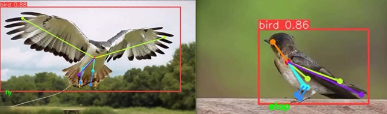
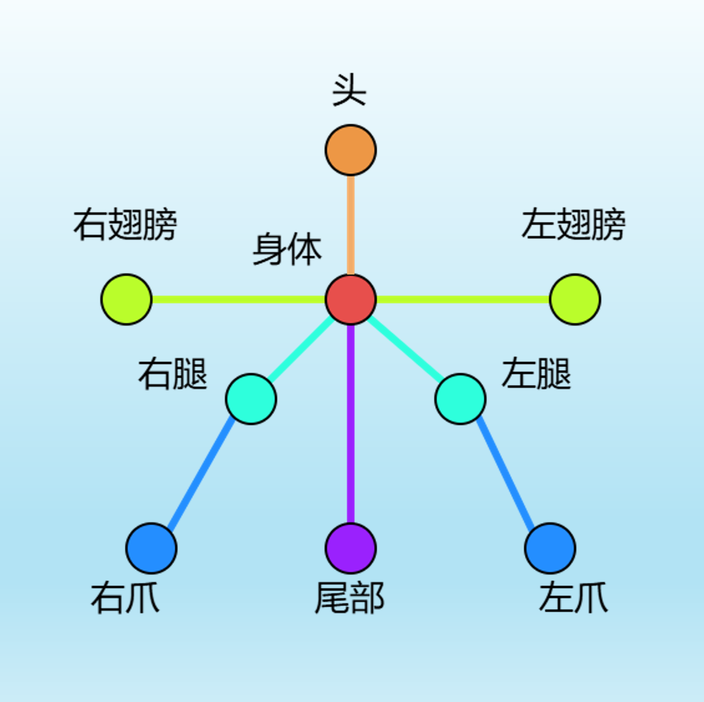
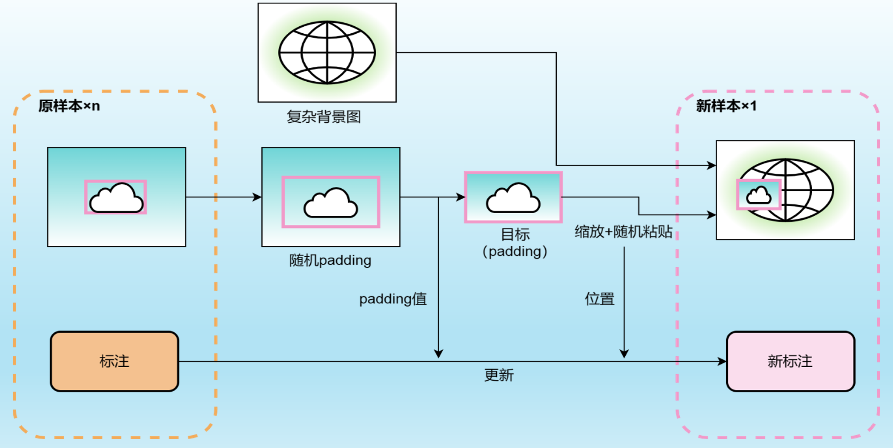
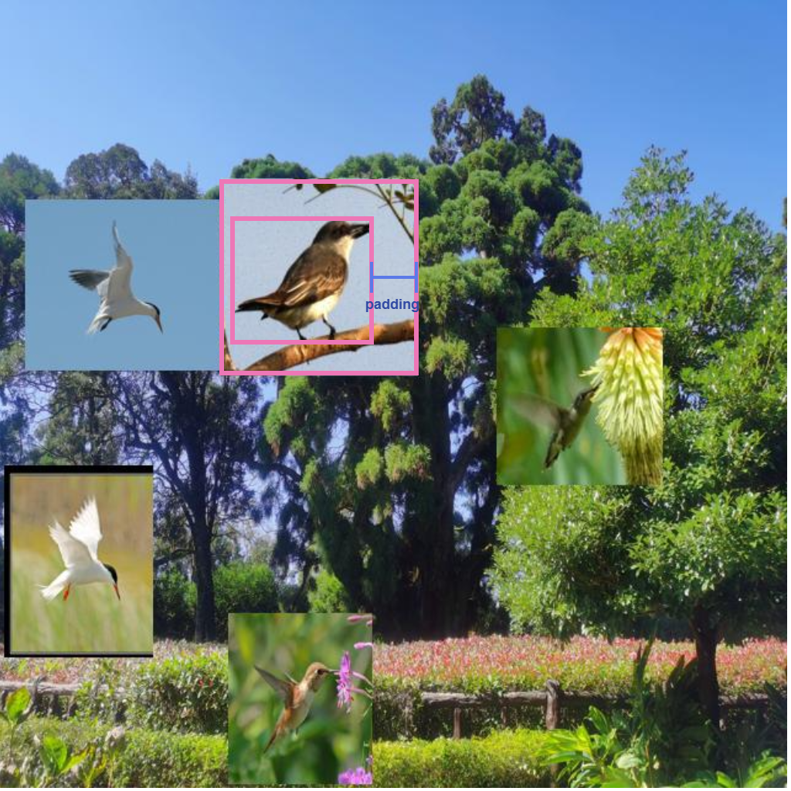
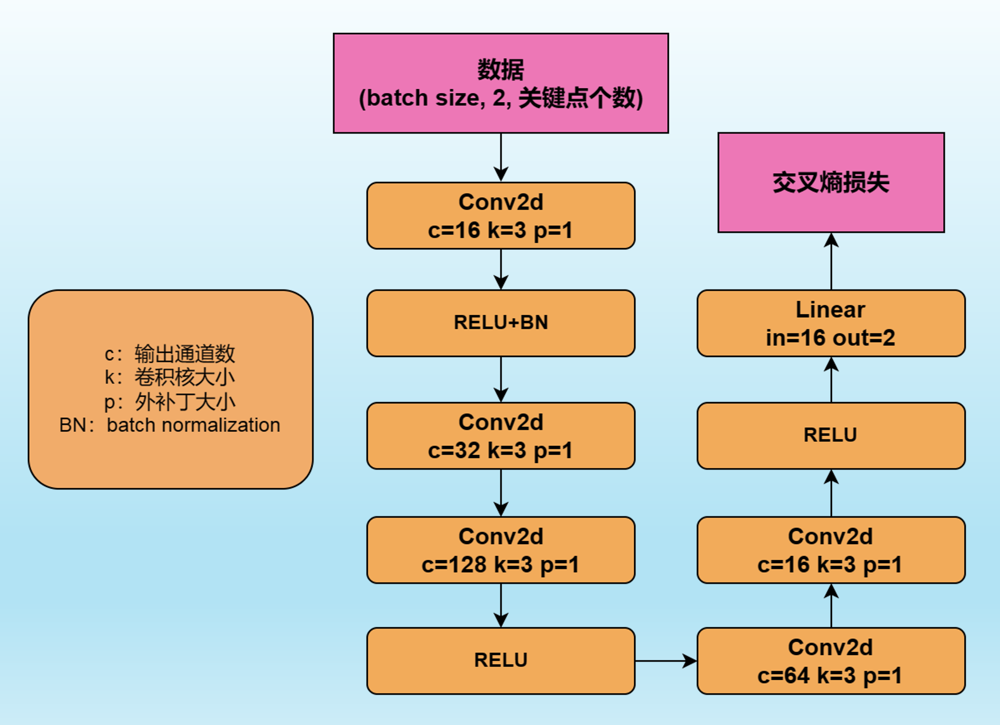
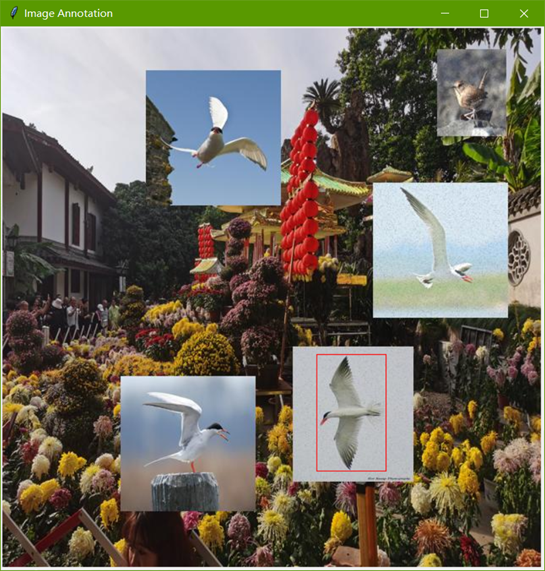
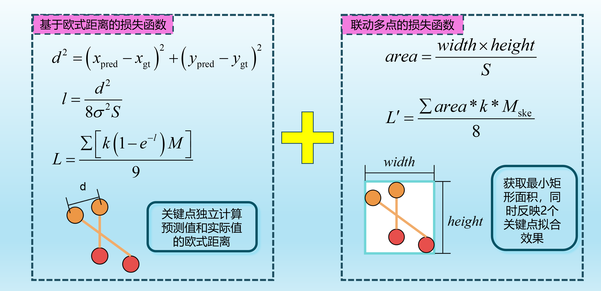
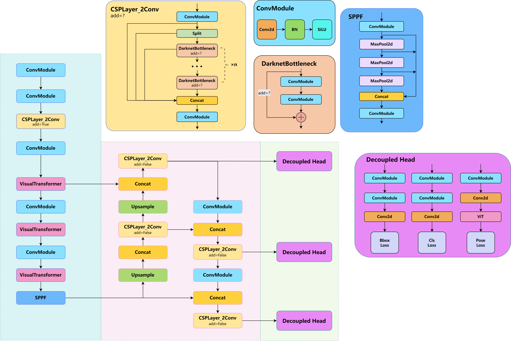

**该项目基于YOLOv8**：https://github.com/ultralytics/ultralytics

[English README](README-en.md)
# 🔥本项目数据集链接
百度网盘：https://pan.baidu.com/s/1IAbgjSZs9G7XmKPEwMiBdw?pwd=1213 提取码：1213
google：https://drive.google.com/drive/folders/12iIgp0_4aPTHtyqNYhfS4ZwWmwBjVXlE?usp=drive_link
- bird_pose.zip值姿态输出卷积网络数据集，posehead.pt是其训练好的模型。
bird.zip则是YOLOv8 COCO格式的关键点检测数据集，best.pt是本工作训练好的对应数据集（并非最强）。
**两个网络需要配合使用才能进行姿态判断，详情查看以下介绍。**

# 🔥概述
项目在YOLOv8基础上，以鸟类姿态检测为任务，设计了鸟类关键点，使用新的关键点回归损失函数，使用ViT模块改变网络结构，设计了外接的卷积输出网络将关键点映射到鸟类姿态分类，提供基于拼接的数据增强操作。效果如下：

# 🔥技术
## 鸟类关键点设计
数据集的标签结构基于下图：

## YOLOv8鸟类关键点数据集
YOLO的COCO数据集关于关键点的标签整体格式如下：
`<class-index> <x> <y> <width> <height> <px1> <py1> <p1-visibility> <px2> <py2> <p2-visibility> …<pxn> <pyn> <p2-visibility>`
- 标注数据的行数即单张图片当中的目标个数，每行各一个目标，依次有分类标签、边界框四元数组（1个）、关键点三元数组（9个）等标注。其中边界框的定位是依靠边界框中心进行定位，由于9个关键点并不一定都能出现于每个目标当中，所以关键点需要标注一个状态值，当关键点不存在时，该关键点回归的损失将被排除。

## 数据增强
其实YOLOv8自带不少数据增强，我实现了类似的一种，如果需要额外使用它，项目也提供了该脚本。流程如下，提供一个背景文件夹里面放上无鸟类的各种背景图，将**已标注的**鸟类数据集中的鸟类边界框略微扩大后贴到背景图上。可以选择贴多个目标，并且设置缩放倍数。

效果如下图：

## 关键点->姿态分类
通过在YOLOv8关键点输出外接一个卷积输出网络，可以得到姿态分类，网络结构如下，十分简单，这正能反映关键点检测对于姿态判断十分高效，且该输出网络可以与YOLOv8分开训练，可以为不同任务设计不同的输出网络。

**标注数据集以训练该网络**：
我使用Python的Tkinter库编写了一个标注脚本，将已标注图像依次显示并将对应的目标逐一框选出来，标注则通过键盘键入0或1实现分类，生成对应的label文件，格式为：`<class-index> <px1> <py1> <px2> <py2> …<pxn> <pyn>`。

## 新的损失函数
可以选择使用新设计的损失函数进行训练（不一定更有效）：

## 结合ViT的新网络
可以选择是否使用ViT模块改变网络结构（速度会更慢）：

# 🔥项目结构
- `datasets`：数据集及其工具的文件夹。
- `imgs`：预测用的图片、视频存放处。
- `posehead`：外接卷积输出网络的文件夹。
- `runs`：训练和验证结果存放处。
- `ultralytics`：YOLOv8本体。
- 其他文件夹不用详细了解。

# 🔥重要文件说明
## 主文件夹
- `测试.ipynb`：可训练（一般不用）、预测（图片或视频）、验证模型的脚本，视频预测针对的是添加了外接卷积输出网络的姿态分类任务。
- `人类.py`：原项目对于人类的预测脚本，需要根据“改动”中进行更改。
- `对比效果.py`：图片预测，同时用**两个模型**预测同样的图输出预测结果并排显示。
- `网络图生成.py`：生成网络的详细图（onnx格式文件），包括张量形状、网络参数等信息，用于调试网络或概览网络。
- `训练.py`：训练模型用的脚本。
- `预测.py`：预测图片用的脚本。
- `验证.py`：验证模型用的脚本。
## posehead文件夹
- `PoseHead.py`：外接卷积输出网络的网络结构。
- `train.py`：训练PoseHead用的脚本。
- `posehead.pt`：训练出来的模型。
## datasets文件夹
- `background`：存放背景图的文件夹，数据增强用到的背景。
- `bird`：训练YOLO网络用的数据集。
- `bird_enhance`：数据增强生成的图片及标注存放的文件夹。
- `bird_pose`：训练外接卷积输出网络PoseHead的数据集。
- `数据集转换.py`：改变数据集格式，从`train/valid/test`下分别存放`images/labels`格式改为`images/labels`下分别是`train/val/test`格式。
- `数据增强.py`：数据增强脚本，详见脚本内说明。
- `姿态分类标注.py`：该脚本用于生成PoseHead网络数据集需要的标注文件，详见脚本内说明。
## ultralytics文件夹
- `cfg/default.yaml`：里面有模型训练、验证、预测各方面的配置、超参数等，可以在里面改也能在调用函数中设置。
- `cfg/models/v8/yolov8-pose.yaml`：存放YOLOv8姿态识别的网络结构，包括更改过的结构。
- `cfg/datasets`：里面存放各种数据集配置的yaml文件，包括本项目鸟类识别的`bird.yaml`文件。
- `nn/modules`：存放网络结构文件，其中`clip_model.py`是vit模型的结构是新加的。
- `utils`：`loss.py`有损失函数，`metrics.py`有评价指标。
# 🔥改动操作
**可以通过以下步骤选择是否更改网络结构、是否使用新的损失函数等技术操作。**
**注意：数据集链接当中的权重文件如果想要直接使用，就不能修改1-3项**
1. 新的结构：`ultralytics/cfg/models/v8/yolov8-pose.yaml`，有多组backbone，使用一组注释其他组。
2. 新的解耦头：`ultralytics/nn/modules/head.py`，`Pose`类下`self.cv4`（161行左右），一组使用ViT，另一组没有。
3. 鸟类和人类姿态识别更改：`ultralytics/utils/plotting.py`，`Annotator`类下`kpts`函数的bird变量，为True检测鸟类
4. 新的关键点损失函数：`ultralytics/utils/loss.py`，`KeypointLoss`类下前向传播函数（138行），`new_poseloss`变量决定是否用新的损失函数。